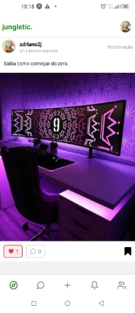

**Jungletic App**

\*\*\* OBS \*\*\* : This a complete app that I have done by myself, I’m the only developer in my startup co-founders team and I built alone! 

OBS: The app is live on Play Store, you can download and see how smooth it is: https://play.google.com/store/apps/details?id=com.adriano2020.Jungletic

Jungletic is social media that aims to gather entrepreneurs and help them to connect and be more reproducible in their business, it is a digital secure and appropriate space for experience exchanges among entrepreneurs, where they can find potential customers, suppliers and business partners.

**INFRASTRUCTURE**:

**FRONTEND**:

- React Native/Expo
- Recoil
- Firebase
- Sentry (For monitoring)
- Firebase analytics (For Metrics)

**Features**:

- Users can upload an image from the device to Firebase CloudStorage
- Users Should be able to share content to other applications such as Facebook and Instagram.
- Users are able to receive push notifications when determined events happens (such as getting a new follower or a new direct message)
- Users can listen in real time to new messages in direct and discussions. chats.
- Users are able to see the app content either in English or Portuguese

**Challanges** :

- Create a lightweight way to switch languages in the app
- Create a background layer for handling long running tasks , such as uploading files
- Create a performant way of setting listeners in different screens without affecting performance
- Create a nice experience for custom push notification actions (Such as Follow back on new follower notifications)
- Create nice feel and reusable components that fits well in Android and IOS.

**BACKEND**:

- NodeJS
- MySQL (Main database)
- Firebase Admin (to generate auth tokens and send push notification through FCM)
- Worker (Built on top of NodeJS)
- RabbitMQ
- Socket.io
- Redis (For a cache a layer and as Socket.io Adapter)
- Meili Search

**Features**:

- Users are able to sign up with  email and password
- Users are able to authenticate ( SignIn ) with email and password
- Users are able to create and publish post
- Users are able to like , comment, reply to comments and share posts.
- Users are able to follow each other 
- Users are able to open a direct message chat with each other
- Users are able to create discussion topics (Which create a discussion room for the topic)
- Users are able to subscribe to a discussion topic , so they get notified whenever there is a new message on the discussion. 
- Users are able to update their profile data.
- THE WORKER MICROSERVICE: is able to broadcast messages on direct and topic discussion rooms
- THE WORKER MICROSERVICE: is able to broadcast notifications to users whenever determined events happen.

CHANGES:

- Create a fast Rest Api for the clients
- Create the right relations between tables and self relations to accurate the features.
- Create a solid architecture the Real time side of the product , such as real time notifications, and real time chats.

